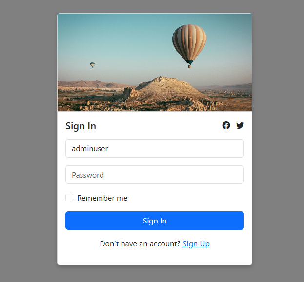

# LARAVEL-MANUAL-SIGN-IIN-AUTHENTICATION

[![Youtube][youtube-shield]][youtube-url]
[![Facebook][facebook-shield]][facebook-url]
[![Instagram][instagram-shield]][instagram-url]
[![LinkedIn][linkedin-shield]][linkedin-url]

Thanks for visiting my GitHub account!


## Project Roadmap

|                     |
| :-----------------: |
|       Roadmap       |
|  |

- Step-1: Blade Template for Sign-In Page (resources/views/login.blade.php)

```bash

<!DOCTYPE html>
<html lang="en">

<head>
    <meta charset="UTF-8">
    <meta name="viewport" content="width=device-width, initial-scale=1.0">
    <meta name="csrf-token" content="{{ csrf_token() }}">
    <title>Responsive Sign In Card</title>
    <!-- Bootstrap CSS -->
    <link href="https://cdn.jsdelivr.net/npm/bootstrap@5.3.0/dist/css/bootstrap.min.css" rel="stylesheet">
    <style>
        body {
            background-color: gray;
            display: flex;
            justify-content: center;
            align-items: center;
            height: 100vh;
            margin: 0;
        }

        .card {
            background-color: white;
            width: 100%;
            max-width: 400px;
            box-shadow: 0 4px 8px rgba(0, 0, 0, 0.2);
        }

        .card-header img {
            width: 100%;
            height: 200px;
            object-fit: cover;
        }
    </style>
</head>

<body>
    <div class="card">
        <div class="card-header p-0">
            
        </div>
        <div class="card-body">
            <div class="d-flex justify-content-between align-items-center mb-3">
                <h5 class="m-0">Sign In</h5>
                <div>
                    <a href="#" class="text-dark me-2 border-circle border-info"><i
                            class="bi bi-facebook"></i></a>
                    <a href="#" class="text-dark"><i class="bi bi-twitter"></i></a>
                </div>
            </div>
            <form method="POST" action="{{ route('user.submit') }}">
                @csrf
                <div class="mb-3">
                    <input type="text" name="username" class="form-control" placeholder="Username">
                </div>
                 @error('username')
    <span style = "color:red;">{{ $message }}</span><br><br>

    @enderror
                <div class="mb-3">
                    <input type="password" name="password" class="form-control" placeholder="Password">
                </div>
                      @error('password')
    <span style = "color:red;">{{ $message }}</span><br><br>

    @enderror
                <div class="form-check mb-3">
                    <input type="checkbox" name="remember" class="form-check-input" id="rememberMe">
                    <label class="form-check-label" for="rememberMe">Remember me</label>
                </div>
                <input type="submit" class="btn btn-primary w-100" value='Sign In'>
            </form>
            <p class="text-center mt-3">
                Don't have an account? <a href="#">Sign Up</a>
            </p>
        </div>
    </div>

    <!-- Bootstrap Icons and JS -->
    <script src="https://cdn.jsdelivr.net/npm/bootstrap@5.3.0/dist/js/bootstrap.bundle.min.js"></script>
    <link href="https://cdn.jsdelivr.net/npm/bootstrap-icons/font/bootstrap-icons.css" rel="stylesheet">
</body>

</html>

```

2. Seed Route for User Insertion (routes/web.php)

```bash

Route::get( '/seed-users', function () {
    DB::table( 'users' )->insert( array(
        'username' => 'adminuser2', // Add a username
        'name' => 'Admin2',
        'email'    => 'admin2@example.com',
        'password' => Hash::make( 'password' ), // Default password
    ) );
    return 'User created with username adminuser!';
} );

// Authentication routes
Route::get( '/user-login', array( AuthController::class, 'showLoginForm' ) )->name( 'userlogin.show' );
Route::post( '/user-login', array( AuthController::class, 'userSubmit' ) )->name( 'user.submit' );

Route::post( '/logout', array( AuthController::class, 'logout' ) )->name( 'logout' );

// Home route, protected by authentication
Route::middleware( 'isLoggedIn' )->get( '/home', function () {
    return view( 'home' );
} );

```

3. Login Controller (app/Http/Controllers/AuthController.php)
create controller -> 
```bash 
php artisan make:controller AuthController
```

- Place the followin code in AuthController.php file

```bash 
<?php

namespace App\Http\Controllers;

use Illuminate\Http\Request;
use Illuminate\Support\Facades\Auth;

class AuthController extends Controller {
    public function showLoginForm() {
        return view( 'user_login' );
    }

    public function userSubmit( Request $request ) {
        $request->validate( array(
            'username' => 'required|string',
            'password' => 'required|string',
        ), array(
            'username.required' => "Name must be filled up!",
            'password.required' => "Password filled must be required!",
        ) );

        // dd( $request->all() );
        // Attempt to log in using username and password
        if ( Auth::attempt( array( 'username' => $request->username, 'password' => $request->password ) ) ) {
            $request->session()->regenerate();
            return redirect()->intended( 'home' );
        }

        return back()->withErrors( array(
            'username' => 'The provided credentials do not match our records.',
        ) );

    }

    public function logout( Request $request ) {
        Auth::logout();

        $request->session()->invalidate();
        $request->session()->regenerateToken();

        return redirect( '/user-login' );
    }
}

```


4. Middleware to Prevent Unauthorized Access (app/Http/Middleware/RedirectIfAuthenticated.php)

create controller -> 
```bash 
php artisan make:middleware Authenticate
```

- Place the followin code in Authenticate.php file

```bash
<?php

namespace App\Http\Middleware;

use Closure;
use Illuminate\Http\Request;
use Illuminate\Support\Facades\Auth;
use Symfony\Component\HttpFoundation\Response;

class Authenticate {
    /**
     * Handle an incoming request.
     *
     * @param  \Closure(\Illuminate\Http\Request): (\Symfony\Component\HttpFoundation\Response)  $next
     */
    public function handle( Request $request, Closure $next ): Response {

        if ( Auth::check() ) {
            return $next( $request );
        } else {
            return redirect( '/user-login' );
        }

    }

}

```

6. Home Page Blade Template (resources/views/home.blade.php)

```bash

@auth
    <div class="container mt-5">
        <h1>Welcome to the Home Page</h1>

        <p>Hello, {{ Auth::user()->name }}! You are logged in.</p>
        <form method="POST" action="{{ route('logout') }}">
            @csrf
            <button type="submit" class="btn btn-danger">Logout</button>
        </form>
    </div>
@endauth

```


7. Database Migration for Users Table (database/migrations/xxxx_xx_xx_create_users_table.php)

```bash

<?php

use Illuminate\Database\Migrations\Migration;
use Illuminate\Database\Schema\Blueprint;
use Illuminate\Support\Facades\Schema;

return new class extends Migration {
    /**
     * Run the migrations.
     */
    public function up(): void {
        Schema::create( 'users', function ( Blueprint $table ) {
            $table->id();
            $table->string( 'username' )->unique(); // Add username column
            $table->string( 'name' );
            $table->string( 'email' )->unique();
            $table->timestamp( 'email_verified_at' )->nullable();
            $table->string( 'password' );
            $table->rememberToken();
            $table->timestamps();
        } );

        Schema::create( 'password_reset_tokens', function ( Blueprint $table ) {
            $table->string( 'email' )->primary();
            $table->string( 'token' );
            $table->timestamp( 'created_at' )->nullable();
        } );

        Schema::create( 'sessions', function ( Blueprint $table ) {
            $table->string( 'id' )->primary();
            $table->foreignId( 'user_id' )->nullable()->index();
            $table->string( 'ip_address', 45 )->nullable();
            $table->text( 'user_agent' )->nullable();
            $table->longText( 'payload' );
            $table->integer( 'last_activity' )->index();
        } );
    }

    /**
     * Reverse the migrations.
     */
    public function down(): void {
        Schema::dropIfExists( 'users' );
        Schema::dropIfExists( 'password_reset_tokens' );
        Schema::dropIfExists( 'sessions' );
    }
};

```


## Testing Steps:
Run Migrations:
```bash

php artisan migrate
```

- Seed Data: Visit /seed-users in the browser.
- Access Login: Visit /user-login.
- Access Home: After login, visit /home.


## Follow Me

[](https://github.com/learnwithfair) [](https://www.facebook.com/learnwithfair/) [](https://www.instagram.com/learnwithfair/) [](https://www.twiter.com/learnwithfair/) [](https://www.youtube.com/@learnwithfair)

<!-- MARKDOWN LINKS & IMAGES -->

[youtube-shield]: https://img.shields.io/badge/-Youtube-black.svg?style=flat-square&logo=youtube&color=555&logoColor=white
[youtube-url]: https://youtube.com/@learnwithfair
[facebook-shield]: https://img.shields.io/badge/-Facebook-black.svg?style=flat-square&logo=facebook&color=555&logoColor=white
[facebook-url]: https://facebook.com/learnwithfair
[instagram-shield]: https://img.shields.io/badge/-Instagram-black.svg?style=flat-square&logo=instagram&color=555&logoColor=white
[instagram-url]: https://instagram.com/learnwithfair
[linkedin-shield]: https://img.shields.io/badge/-LinkedIn-black.svg?style=flat-square&logo=linkedin&colorB=555
[linkedin-url]: https://www.linkedin.com/in/rahatul-rabbi/
